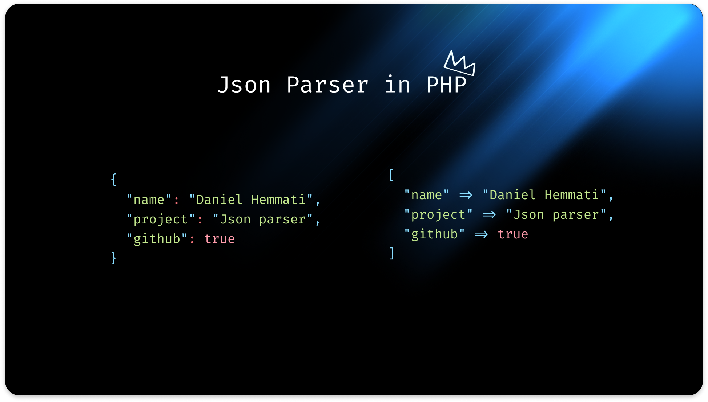

# 🚀 Json parser in mighty php

<p align="center">
    
</p>

## Overview

A simple JSON parser implementation in PHP that parses JSON strings into PHP data structures. This project demonstrates how to build a JSON parser from scratch without relying on PHP's built-in `json_decode()` function.

If you like to build your own JSON parser and you need to understand how it works, this project is for you.

## Features

- ✅ **Complete JSON compliance** - Passes the official [JSON.org test suite](https://www.json.org/JSON_checker/)
- ✅ **Full data type support**:
  - Strings with escape sequences (`\"`, `\\`, `\/`, `\b`, `\f`, `\n`, `\r`, `\t`)
  - Numbers (integers, floats, scientific notation: `1e3`, `5.5e-1`)
  - Booleans (`true`/`false`)
  - `null` values
  - Arrays (nested and empty)
  - Objects (nested and empty)
- ✅ **Advanced string parsing**:
  - Unicode escape sequences (`\uXXXX`)
  - Control character validation (prevents unescaped control chars)
- ✅ **Robust number validation**:
  - Prevents invalid leading zeros (e.g., `013`)
  - Supports scientific notation (`1e3`, `2e+00`, `5.5e-1`)
  - Handles negative numbers and decimals

## Installation

### Prerequisites

- PHP 8.4+
- Composer

### Local Setup

1. Clone the repository:

```bash
git clone https://github.com/DanielHemmati/json-parser-in-php
cd json-parser-in-php
```

2. Install dependencies:

```bash
composer install
```

3. Run the tests:

```bash
./vendor/bin/pest
```

## Contributing

Contributions are welcome! Please feel free to submit a pull request.

### Todos

- [ ] Show the memory consumption of the parser (use `gc_collect_cycles()` to collect the memory)
- [ ] Add suppport for not loading all of the json into memory at once (see [read json-machine for study](https://github.com/halaxa/json-machine))

## License

This project is licensed under the MIT License - see the [LICENSE](LICENSE) file for details.
